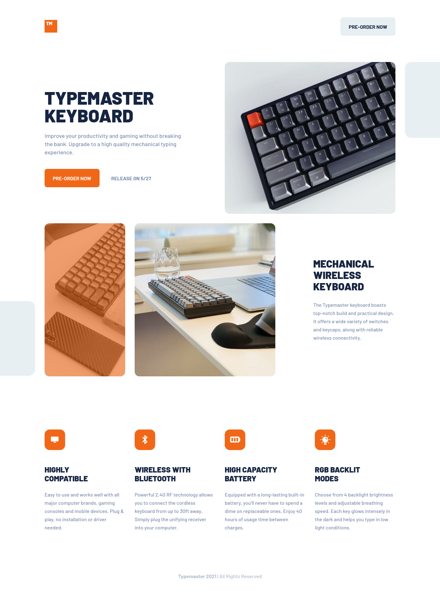

# Frontend Mentor - Typemaster pre-launch landing page solution

This is a solution to the [Typemaster pre-launch landing page challenge on Frontend Mentor](). Frontend Mentor challenges help you improve your coding skills by building realistic projects.

## Table of contents

- [Frontend Mentor - Typemaster pre-launch landing page solution](#frontend-mentor---typemaster-pre-launch-landing-page-solution)
  - [Table of contents](#table-of-contents)
  - [Overview](#overview)
    - [The challenge](#the-challenge)
    - [Screenshot](#screenshot)
    - [Links](#links)
  - [My process](#my-process)
    - [Built with](#built-with)
  - [Author](#author)

## Overview

### The challenge

Your users should be able to:

- View the optimal layout depending on their device's screen size
- See hover states for interactive elements

### Screenshot

### Links

- Solution URL: [URL](https://www.frontendmentor.io/solutions/typemaster-pre-launch-landing-page-H6__KXkGRK)
- Live Site URL: [URL](https://lisviks.github.io/typemaster-pre-launch-landing-page-frontendmentor/)

## My process

### Built with

- Semantic HTML5 markup
- Flexbox
- CSS Grid
- Mobile-first workflow
- [React](https://reactjs.org/) - JS library

## Author

- Website - [Deividas Rimkus](https://deividas.blog)
- Frontend Mentor - [@Lisviks](https://www.frontendmentor.io/profile/Lisviks)
- Twitter - [@DRimkusDev](https://www.twitter.com/DRimkusDev)
- Github - [Lisviks](https://github.com/Lisviks)

